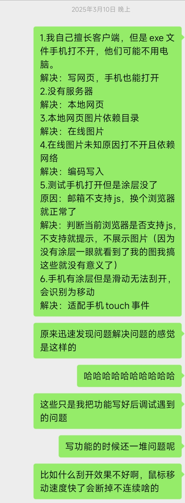

@author:yhoodie  
@date:2026-08-06  
@LICENSE:MIT
# 你可能想了解的
## 这是什么  
### 界面预览
<https://yhoodie.github.io/scratch_surprise/scratch.html>
### 项目结构
```text
.
├── README.md             # 项目说明文档  
├── docs/                 # 存放README.md所需引用内容
|   └── summary.jpeg      # README.md引用的图片
├── scratch.html          # 源代码及展示页面
└── img/                  # 图片资源目录
    ├── background.jpg    # 背景图，用于制作surprise.png的图片素材
    ├── surprise.jpg      # 待刮开的惊喜，用于制作surprise.png的图片素材
    ├── surprise.png      # 刮刮乐主图，由surprise.psd生成
    └── surprise.psd      # 刮刮乐主图工程文件

```
### 解释说明
项目本身是一个类电子刮刮乐界面，但开发侧重于隐藏信息刮开时的惊喜感，而非刮刮卡的赌博性质。因此，背景图片比较重要，刮开的动作仅为辅助技术手段。可用于亲友间远程惊喜展示等。具体详见[项目背景](#bg)。
### 差异亮点
1. 刮开之处是大块视觉展示，不是“一等奖”这种简单文字；   
2. 支持鼠标及触屏；   
3. 支持判断浏览器是否支持或禁用js，防止因环境问题内容提前被看到，丧失惊喜感；   
4. 刮开动作丝滑，粗细适中，刮开模拟真实且方便。   
5. 图片内置。   

感兴趣具体详见[实施过程](#ac)。
## 如何使用
1 制作一张属于自己的展示图片。本示例图片为567\*850，矩形覆盖为460\*460，覆盖位置由示例图片计算，若使用示例psd制作，保持背景图和待刮开区域（psd源文件中标尺参考线框出的正方形区域）大小一致，则无需进行改动，直接跳到第2步。   
&emsp;1.1 若覆盖区域有变，则修改矩形覆盖区域控制代码：`context.fillRect(54,338,460,460);`   
&emsp;1.2 若主图大小有变，或希望修改页边距，则修改代码：
```
			img{  
				width: 567px;  
				height: 850px;  
				top: 200px;  
				left: 200px;
				position: absolute;
				z-index: -1;
			}
```
2 通过在线转换工具，将图片转换为base64格式，替换``引号中内容，此行在注释`<!-- 请修改此处图片 -->`后面，可直接整行删除，替换为``后，再用图片数据填充至引号内，避免原图数据加载缓慢甚至卡死。
## 未来展望
当时因为Photoshop编辑图片更为方便直观（更主要的原因详见[项目背景](#bg)），所以直接把文字图片用Photoshop制作完成后一股脑加载进html页面，然后再根据大小覆盖灰色区域，最后编写擦除代码。但这种方式耦合性较高，若要提升可扩展性，鄙人认为可从以下方面考虑：  
1. 刮开提示词文字内容和样式由标签生成；  
2. 加载图片仅加载背景，刮开区域内容另外加载；  
3. 刮开区域内容和灰色覆盖区域在代码中互相联系。   

这样子每个部分保持独立，可以直接在代码中完成修改，而不必依托专业图像编辑软件，再对位置大小等进行硬编码，导致局限性较大。  
以上是其中一部分想法，希望能抛砖引玉，欢迎讨论。
# 我自己想记录的
## 基本信息
&emsp;&emsp;`scratch.html`框架于2025.3.10编写，原始图片于2025.3.15制作，图片和html框架于2025.3.16联调，示例图片于2026.8.5重新制作，本文档于2026.8.6编写。  
&emsp;&emsp;代码使用VSCode和Copilot，图片使用Photoshop。
## <a id="bg"></a>项目背景
&emsp;&emsp;当时有一个周边物料制作需要，思路是打印明信片，再贴上刮刮乐覆膜。所以我使用Photoshop先制作了需要打印的明信片图案，但是明信片定制需要一定的时间，还需要手动贴上覆膜，再线下传递。当时有些来不及，所以想着线上做个效果图，不受距离影响方便查看。这也是我为什么代码层面只是加一层灰色覆盖区域实现刮开效果，而没有考虑可扩展性的主要原因。当时已有[^1]表现的视觉图片，仅需要迁移线上查看刮开效果。  
&emsp;&emsp;文字内容应当作为引起兴趣和遐想的提示词，然后再互动进行刮开操作制造惊喜感。其实这种操作按理说点击按钮出现答案其实也是一样的效果，但一方面是前面的产生背景，这种交互方式只能线上，不方便在线下单页平面纸张上完成，多页或立体纸艺效果，成本较高；另一方面是相较于按钮，刮开的互动性更强，更接近于自主探索揭开迷雾的感觉，更有代入感。
## <a id="ac"></a>实施过程
### 现状调研
&emsp;&emsp;明确了需求，当然是要进行“市场调研”，就像写论文一样，要先了解研究现状，再提出自己的创新点，否则重复造轮子也没什么意义。更何况刮刮乐这种非常常见和简单的内容，拿来即用或者微调一下效率比较高。但是要调整得比较多的话……就不如自己重写了。当时在GitHub上搜索开源项目，主要有以下不符合我需求的几种类型：  
1. 类似抽奖的刮刮乐，刮开以后是文字，“特等奖”“一等奖”这种；  
2. 鼠标刮开时非常细，那样刮不知道要刮到猴年马月去，刮半天看不出来个局部，心情已经烦躁了；  
3. 象征性刮几下，覆盖就渐变消失了，一方面互动性弱，和按钮类型没什么本质差别，一方面对实际刮开涂层的模拟性差，无法自主控制刮开区域和进度等。  

其实这些问题，发现了也好解决，就像调试解决bug一样。但问题是，这并不是一个庞大的项目，而是一个非常微小的需求，与其去改结构不清晰、功能不完善的代码，不如自己从头写。屎上雕花是庞大项目的无可奈何，这种小需求还是避免屎山代码了。而且根据我的需求，主要功能都改得面目全非，改的远比省的多，还要被原代码束缚，甚至代码规范和框架也不见得优秀，最终还是选择自己从头开始。
### 编码调试
&emsp;&emsp;我本身是C++的客户端开发，前端知识接触过但并不熟悉，所以这里用到了Copilot来帮我编写框架，然后再局部加入需要的功能。主要经历了如下迭代。  
1. 基础功能。图片显示、灰色矩形绘制、鼠标擦除绘制。  
2. 图片内置。   
3. 触屏擦除绘制。  
4. js支持性判断及提示。  

&emsp;&emsp;看起来很明确的功能点，但都是在调试下逐步完善的。比如在电脑上调试就要先让图片和灰色矩形显示合适的大小和位置，鼠标擦除时又涉及粗细和流畅度等问题。比如刚开始很细，调整粗了以后两端又是矩形，不太美观；把末端设置为圆形后，擦除时又变成离散的点而不连贯等。  
&emsp;&emsp;由于需求是方便查看，而使用手机的用户与频率都是远高于计算机的，所以计算机上调试好后又进一步迁移到手机上调试。为了方便手机查看，图片就需要内置而不是引用。与此同时，在基础需求之外，新的问题又爆出来：鼠标是鼠标，触屏是触屏，手指移动行为并不能出发鼠标操作，所以触屏逻辑要单独实现。手机端浏览器调试好以后，又发现在文件传输时所有内容会直接显示出来，因为有的环境不支持js，于是就直接显示html的内容了。但我的需求是交互性和模拟性，没有js可以不显示但不能把重要信息直接展示出来。由此增加了判断环境对js的支持，以及不支持时图片也不展示。
## 复盘感想
&emsp;&emsp;虽然这是一个一百多行的非常小的需求，但我认为它“麻雀虽小，五脏俱全”，包含了一个项目所需经历的流程。  
&emsp;&emsp;首先是需求分析，然后是主要功能开发，最后是测试迭代。它并不是一道算法题，根据题目就马上给出答案，顶多根据报错和输入输出调整一下。它是真实的需求场景，需要根据测试和反馈分析其所需功能并逐步优化。  
AI是一个很好用的工具，但需要懂得如何使用，找到合作之法。在这个微型项目中，我感受到如此简单的需求也需要这么多的调试，但调试的方向是明确的，和Copilot的合作是高效的。  
&emsp;&emsp;对于我而言，我只是知道html的标签和基本格式，但是对于其方法等等是比较陌生的，js就更是陌生了。但这种文档查找和规范类的东西是AI的强项，我不需要记住，省去了很多学习时间与成本。而我的强项则在于调试与判断。我需要根据现有内容进行调试，不断贴合需求，判断需要哪些功能和努力方向，对于我不擅长的陌生部分，给予明确清晰的指令，让AI帮我完成。  
&emsp;&emsp;比如说，绘制图片和图形并擦除遮盖层的简单任务，AI能根据指令给出清晰的代码框架，我根据初版效果，判断粗细需要调整，让AI生成对应代码，我再加到合适位置即可。我是不知道线的粗细应该调用什么方法的，也不知道线段末端如何设置为圆形。但我只需要根据现状判断出我在此基础上的需求，再问AI即可。  
&emsp;&emsp;我可以不会写，但我需要有基本的判断能力，以及我需要能看懂代码。因为同样的需求，AI每次给出来的内容很可能是不一样的，我需要在初版上进行一步步迭代和完善，有一个清晰的目标与方向，而不是判断出改进方案后把原始需求变得复杂，然后让AI随机生成每次不一样的缺陷代码。看不懂代码，是不断调整需求，让AI随机黑盒生成结果，需要面对每次不同的质量不同的缺陷的随机性，有些无头苍蝇[^2]；看得懂代码，AI就是一本非常强大的工具书，任由调遣。我判断出问题在哪里，决定应该怎么做，然后交由AI完成具体做法，我再放到具体的位置。  
&emsp;&emsp;比如我发现手机上无法正常刮除，我判断出触屏需要一套代码让AI完成；我发现手机上涂层消失，决断出需要判断js支持性并在不支持的情况下隐藏内容并提示更换环境。这个经验判断是一个高效的节省时间的过程。出现这些问题同样可以直接问AI怎么办，如何解决，但是这样问到直接让AI完成具体任务还有一段距离——现状的表达会影响AI的判断，AI提出的可能性很多又要一一尝试，找到问题所在又要AI给许多解决方案，此时又要不断尝试去寻找最优解……每一轮提问都有表达的精确度问题，每一轮回答都要花时间去找对应的情况。这些都影响着效率，当问题表述不清时无疑需要低效地来回重复，给出的回答也更模糊许多更多尝试和反复沟通，由此带来的时间浪费与精力消耗是巨大的。而我在这个微不足道的项目中调试和迭代的过程与AI配合有种难言的默契，虽然项目微小用处不大内容简单，但这种迁移已有调试经验去无缝匹配陌生技术的丝滑带来了成就感。也许这就是AI时代我们应当具备的协作能力？  
&emsp;&emsp;在开始之前我认为直接告诉AI应该直接就能出结果了，因为这个项目过于微小。但实际上藏着许多问题。前面所说的只是比较有代表性的几个罢了。原理很简单但是适配细节还是免不了花时间。不过这种“兵来将挡，水来土掩”的感觉真的很美妙！合作愉快！
# 其他
&emsp;&emsp;为什么突然上传这个项目呢？因为看着空空如也的GitHub，我觉得也该有点项目吧。虽然这一行不要求像美工他们那样具备作品集，但程序员的开源项目还是比较重要。当然，我这个不重要，因为过于微小，估计也是没人会看的东西。但是复杂的项目呢，都是公司内基于商业代码的需求，就算是复杂些的工具类内容，也是基于公司业务或者特定场景的内部工具，即便是与公司业务隔离，也有很多公司的代码规范，肯定是无法上传开源的。私下里也没有时间写那些复杂的项目，只能找一找随手一晚上完成的简陋程序片段凑凑数了。但我认为，流程、逻辑、思路这些也很有价值！对于个人成长而言，过程比结果更有价值！遂编写此文档一同上传。  
&emsp;&emsp;说起来有些当下要用的小工具用完就删了也没保存，因为觉得太微小了难登大雅之堂，唉。但是GitHub空空如也的也不好看。但是0 Star又好看到哪去呢？于是恶性循环空空如也……所以，虽然这个项目本身没什么价值，还是写点感想一同上传啦，感觉调试过程和与AI的合作比这个简陋的界面值得一点点~  
&emsp;&emsp;就这样扯了四千多字……感谢你看到这里！如果真的有人能看到这里的话……应该还有一些想说的在写的过程中忘却遗漏了，有缘再补吧……  
&emsp;&emsp;哦对了，示例图片也是现做的，因为原图带点隐私啦，所以随意搞了张用作示例！刚准备提交才发现当时竟然提交过没作图时的demo！震惊，毫无印象。以为是个空号……

[^1]:不是指写代码的时候已经做出来了，而是指这已经是固定要做的内容，需要以此为基础进行方案策划。
[^2]:这种黑盒有点像图像视频生成，很难认为从编码层面调整，否则就是纯手搓了，又要自己PS或者做特效剪辑之类，但是AI并不会给出工程文件。在这一点上，代码要好很多，看懂代码就相当于有了工程文件，能够保持正确的部分，针对有问题的部分不断精进，而不是一次次抽卡。而且在需求不断增加逐渐复杂的情况下，AI会有些丢三落四，每次完成不一样的内容但总无法完美。白盒状态下，自主判断有针对性地精确修改，AI是非常好用的提效工具。   

————————————————2026.8.6更新：我找到当时的记录了！————————————————   
前面所写的还是一年多过后的回忆。突然翻到当时写完的总结！看看当下的记录哈哈哈哈   
  
另外想提一下，做这个如此简单的网页有这种心情主要是，解决复杂项目的问题，通常环境是自己熟悉的，但问题错综复杂花费时间又比较长，解决问题带来的正反馈比较久。而这个陌生环境下完美迁移分析问题的经验，又用AI工具将这种陌生迅速消解，将解决问题的进程拉得快速又丝滑，所以正反馈非常明显。单就这个界面来说其实是没什么技术含量的，也不值一提。但值得提的属于商业机密我也拿不出来啊！  